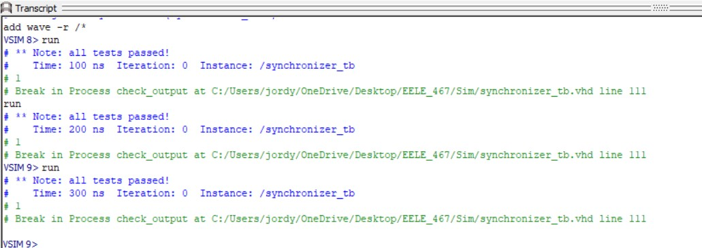
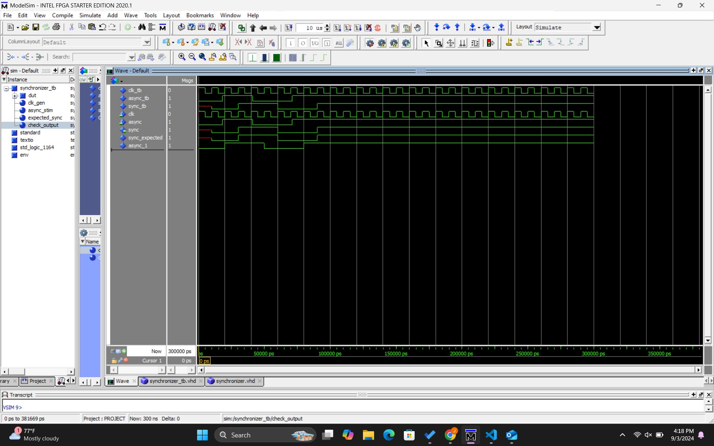

# Homework #3: 2 Flip-Flop Synchronizer

## Overview
This assignment was to implement a synchronizer for later use as a lab component. A synchronizer helps integrate a asynchronous signal into a synchronous design. An external asynchronous signal, like a button press, can introduce metastability where the output signal doesn't quickly settle as a '0' or '1' value.

## Deliverables

Pictured above is the terminal output from the simulation passing the testbench cases.

Pictured above is the waveform from the simulation.

### Questions 
N/A