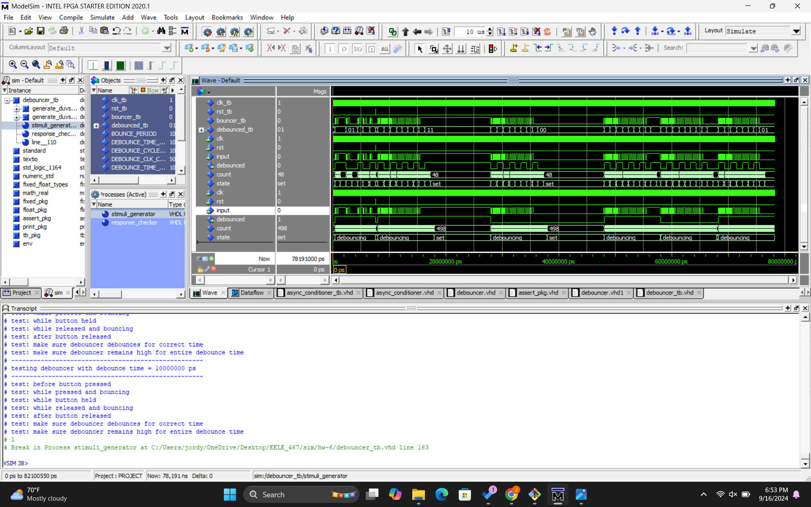
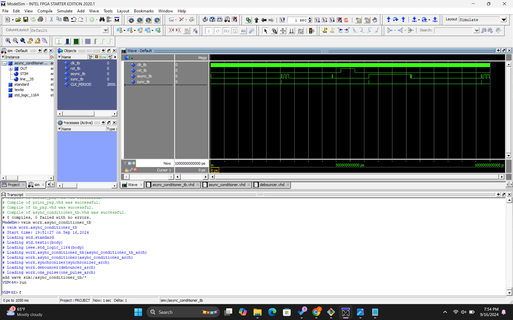
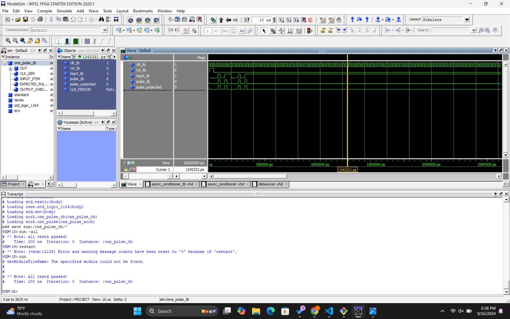

# Homework 6 - Asynchronous Conditioner

## Overview

> The HW 6 assignment completes part of Lab #4, focusing on the LED push button switch. The debounce component removes unwanted noise from the pushbutton signal (PB SW). The one-pulse component generates a single clock cycle input signal in asynchronous conditions. The synchronizer aligns the asynchronous signal from the pushbutton press with the system clock. The asynchronous conditioner instantiates these components to form a cohesive system.

## Deliverables

### Debouncer

### Asynchronous Conditioner

### One Pulse

### Questions

N/A
