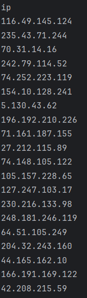
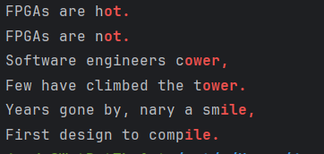
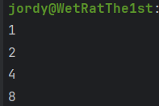

# Homework 7 

## Linux CLI Practice

### Problem 1 
Count the number of words in lorem-ipsum.txt

`wc -w lorem-ipsum.txt`

### Problem 2 
Count the number of characters in lorem-ipsum.txt

`wc -m lorem-ipsum.txt`

### Problem 3 
Count the number of lines in lorem-ipsum.txt

`wc -l lorem-ipsum.txt`

### Problem 4 
Numerically sort file-sizes.txt, taking unit multipliers into account (e.g., 2K, 1G, 4M)

`sort -h file-sizes.txt`

### Problem 5 
Numerically sort file-sizes.txt in reverse order, taking unit multipliers into account

`sort -rh file-sizes.txt`

### Problem 6 
Return the ip address column from log.csv.

`cut -d ',' -f 3 log.csv`

### Problem 7 
Return the timestamp and ip address columns from log.csv.

`cut -d ',' -f 2,3 log.csv`

### Problem 8 
Return the uuid and country columns from log.csv.

`cut -d ',' -f 1,3 log.csv`

### Problem 9 
Print out the first 3 lines of gibberish.txt.

`head -n 3 gibberish.txt`

### Problem 10 
Print out the last 2 lines of gibberish.txt.

`tail -n 2 gibberish.txt`

### Problem 11 
Print out log.csv without the header; that is, print out all but the first line.

`tail -n +2 log.csv`

### Problem 12 
Search for “and” in gibberish.txt.

`grep "and" gibberish.txt`

### Problem 13 
Display each occurrence of “we” (only match “we” as a whole word, not as part of another
word). Also display the line number of each occurrence.

`grep -w -n "we" gibberish.txt`

### Problem 14 
Print all occurrences of “to <word>” in gibberish.txt on their own line. Print only the
matching part of the line in which “to <word>” was found (that is, only print “to <word>”).

`grep -o -i -P "\bto\s\w+" gibberish.txt`

### Problem 15 
Count how many lines FPGAs shows up in fpgas.txt (which is a beautiful poem about FPGAs,
by the way ). Only output the number of occurrences.

`grep -c "FPGAs" fpgas.txt`

### Problem 16 
Print all the rhyming lines in fpgas.txt using grep.

`grep -E "(ot|ile|at|ight|ower|ine|end|ay|ow|ing)[[:punct:]]" fpgas.txt`

### Problem 17 
Count how many lines start with a comment for each VHDL file in your hdl/ folder.

`grep -r '^--' hdl/ --include='*.vhd' | cut -d: -f1 | sort | uniq -c | awk '{print $2 ": " $1}'`

### Problem 18 
Redirect the output of ls to a file (e.g., ls-output.txt). cat the file.

`ls > ls-output.txt`

`cat ls-output.txt`

### Problem 19 
Search for “CPU” in the output of dmesg (the kernel’s log). You will likely need to run dmesg
with sudo.

`dmesg | grep "CPU"`

### Problem 20 
Count how many VHDL files are in your hdl/ directory.

`find hdl/ -type f -name "*.vhd" | wc -l`

### Problem 21 
Count the total number of comment lines in your hdl/ folder.

`grep -r --include='*.vhd' -- '--' hdl/ | wc -l`

### Problem 22 
Print the line numbers where “FPGAs” shows up in fpgas.txt.

`grep -n "FPGAs" fpgas.txt | cut -d ":" -f 1`

### Problem 23 
Find the 3 largest directories in your repository. Print the directory sizes and directory
names.

`du -h * | sort -h | tail -n 3`

