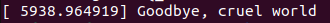
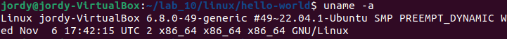
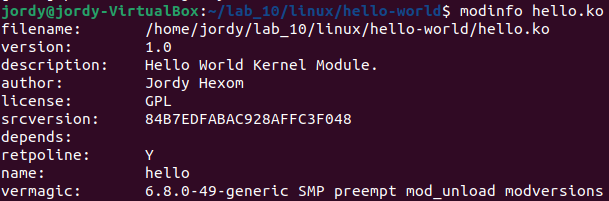
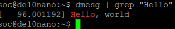
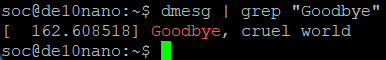
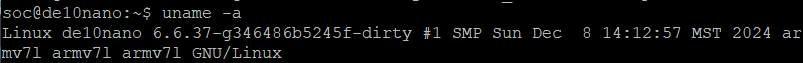
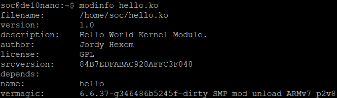

# HW8: Cross-Compiling the Kernel Module for the DE10-Nano

## Overview
This assignment involved ___cross-compiling___ the Linux kernel and a `Hello World` kernel module for the __DE10-Nano SoC__. The kernel was built using __Intel's SoC FPGA repository__, and the module was cross-compiled for the __ARM__ architecture. After building, the kernel and module were verified on the SoC by loading the module and checking for log messages.

## Deliverables
## Ubuntu Virtual Machine
### Kernel Log Messages
- **"Hello, world" message** on module insertion:
  
- **"Goodbye, cruel world" message** on module removal:
  

### System Information
- **Output of `uname -a`**:
  

### Module Metadata
- **Output of `modinfo hello.ko`**:
  

## SOC
### Kernel Log Messages
- **"Hello, world" message** on module insertion:
  
- **"Goodbye, cruel world" message** on module removal:
  

### System Information
- **Output of `uname -a`**:
  

### Module Metadata
- **Output of `modinfo hello.ko`**:
  

## Overview

> #### Architecture
>The kernel module was cross-compiled for the ARM architecture (armhf).

> #### Verification
>The module architecture was verified using the command `file hello.ko` to confirm the ARM architecture in the compiled module. Additionally, the `vermagic` string in `modinfo` output verified compatibility with the kernel version.

## Questions
> What is the function of the `CROSS_COMPILE` variable in the Makefile?
>>The `CROSS_COMPILE` variable specifies the prefix for the cross-compilation toolchain, ensuring the module is compiled for the target ARM architecture.

> Where is the kernel image located after compilation?
>>The kernel image is located at `linux-socfpga/arch/arm/boot/zImage`.

---
## Technologies

- **Linux Kernel Development**
    - Kernel Module Programming
    - Kernel Configuration and Compilation
    - `printk` for logging messages in kernel space

- **Cross-Compilation**
    - ARM Cross-Toolchain (`arm-linux-gnueabihf-`)
    - Use of `ARCH` and `CROSS_COMPILE` environment variables

- **Version Control**
    - Git repository for Intel's SoC FPGA Kernel (`https://github.com/altera-opensource/linux-socfpga`)

- **Makefile**
    - kbuild system for kernel module compilation
    - Out-of-tree module compilation setup

- **Command-Line Utilities**
    - `insmod` and `rmmod` for loading and unloading modules
    - `dmesg` and `grep` for kernel log inspection
    - `modinfo` for verifying module metadata
    - `uname` for system information

- **File Transfer**
    - TFTP for transferring the kernel image to the DE10-Nano
    - NFS for transferring the compiled module to the SoC

- **SoC Hardware**
    - DE10-Nano Development Board
    - ARM Architecture (armhf)

- **Development Environment**
    - Ubuntu _22.04_ OS on VirtualBox VM
    - PuTTY and TeraTerm for SSH access to the DE10-Nano
## Libraries

- **<linux/init.h>**
    - Provides macros and declarations for module initialization and cleanup functions (`__init`, `__exit`, `__initdata`).

- **<linux/module.h>**
    - Includes declarations for module metadata macros (`MODULE_AUTHOR`, `MODULE_DESCRIPTION`, `MODULE_VERSION`, `MODULE_LICENSE`) and the `module_init`/`module_exit` macros.

- **<linux/kernel.h>**
    - Provides access to kernel-level functions such as `printk` for logging messages.

- **<linux/fs.h>**
    - Used for working with filesystems, though not directly used in this assignment.

- **Standard Linux Utilities**
    - `insmod` and `rmmod` for loading and unloading kernel modules.
    - `dmesg` for viewing kernel log messages.
    - `modinfo` for retrieving metadata about kernel modules.
    - `uname` for retrieving system information.

---

## Sources for Understanding the Assignment

- **Advanced Digital System Design using SoC FPGAs _Integrated Software/Hardware Approach_ Textbook**
    - Sections 9.2 and 9.3 provided detailed explanations of kernel module development and debugging.

- **Linux Kernel API Documentation**
    - Reference for [`printk`](https://www.kernel.org/doc/html/latest/core-api/printk-basics.html), basic C library functions in kernel space, and memory allocation techniques.
    - Reference for [kernel](https://www.kernel.org/doc/html/latest/core-api/kernel-api.html) documentation.

- **Linux Kernel Source Code**
    - Accessed via [Elixir Bootlin](https://elixir.bootlin.com/linux/v6.12.1/source) to understand `init.h`, `module.h`, and other headers.
    - For example [`static int __init init_function(void)`](https://elixir.bootlin.com/linux/v6.12.3/source/include/linux/init.h)

- **GNU Tools Documentation**
    - Reference for cross-compilation with `gcc-arm-linux-gnueabihf`.

- **Linux Kernel Makefiles Documentation**
    - Detailed explanation of the kbuild system used for module compilation.

- **Ubuntu and SoC Resources**
    - Intel’s SoC FPGA GitHub repository ([linux-socfpga](https://github.com/altera-opensource/linux-socfpga)) for the SoC kernel source.

---

__NOTE__: ChatGPT4o aided me in putting together this nice `Markdown` document. The extra material helps me remember what to add to my resume, and helps me organize my knowledge.