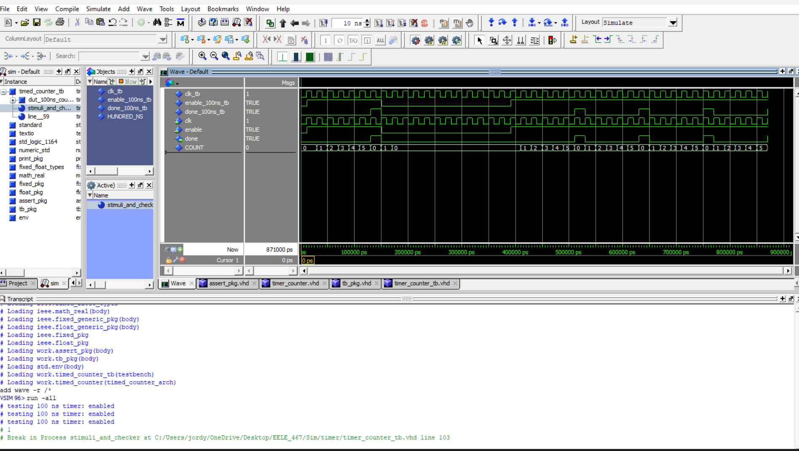
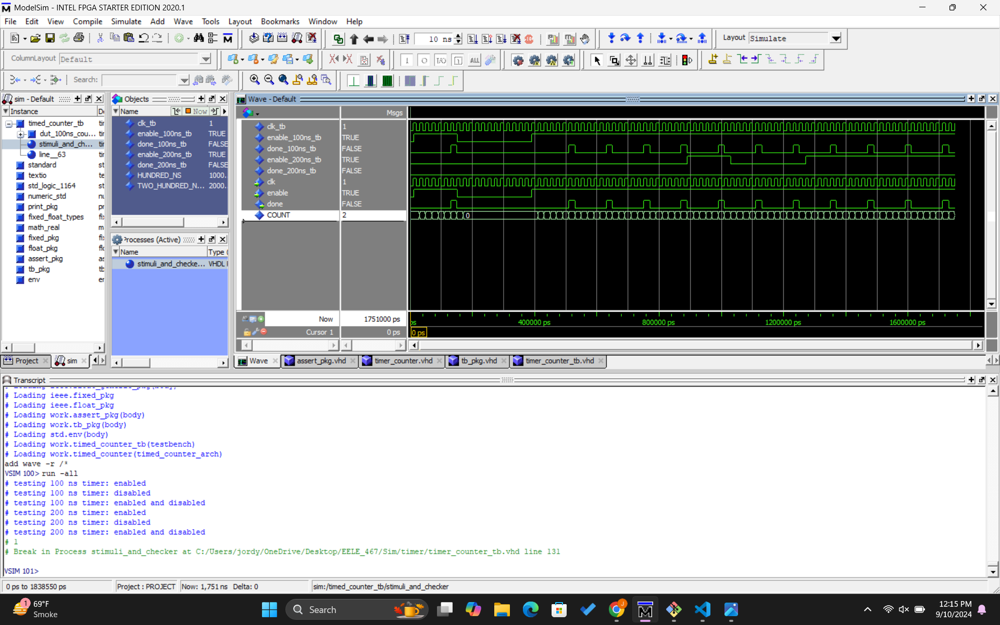

# Homework #4: Timed Counter

## Overview
This assignment was to implement a timed counter and modify a testbench by adding additional cases.

## Deliverables

Pictured above is the transcript window output and waveform from the simulation passing the testbench cases for the first three cases - I forgot to add the last ones. oops.

Pictured above is the transcript window output and waveform from the simulation for all 6 testbench cases, where the last three cases test 200 ns.

### Questions 
N/A