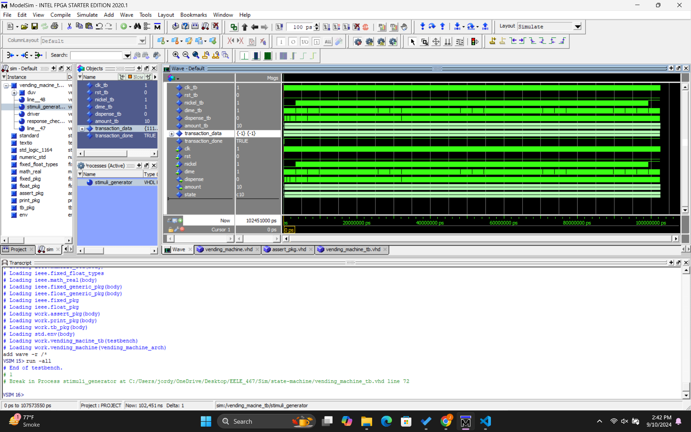
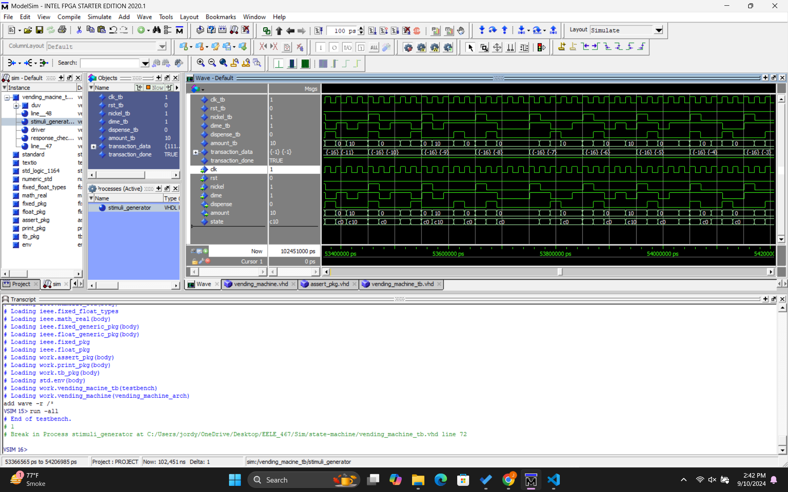

# Homework #5: Vending Machine - Finite State Machine (FSM) 

## Overview
This assignment was to implement a vending machine FSM which passed the given testbench.The purpose of this assignment is to get into the VHDL flow again.

## Deliverables

A zoomed out waveform with the transcript window below it in the bottom left corner.

A zoomed in waveform with the transcript window below it in the bottom left corner.

### Questions 
N/A