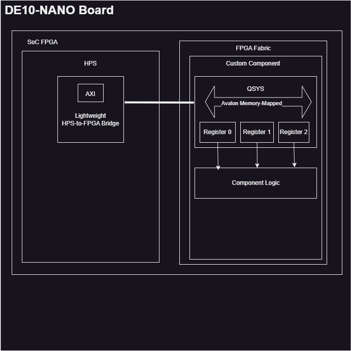

# Lab 6: Custom Hardware Component in Platform Designer

## Vocab

> #### Hard Processor System (HPS)
>A system including CPUs and peripherals that are implemented in silicon.
Compared to a soft processor system that is created using the FPGA fabric, on top of silicon.

 > #### Advanced Extensible Interface (AXI) Bridge 
 > On-chip communication bus protocol.

> #### Bus Protocols
>  A __bus__ is a system of communication pathways that connect components and devices together.
> A bus can be a set of wires or traces embedded in a PCB or chip, used to transfer data. A bus protocol is the set of rules that allow the bus to communicate data.
>
> NOTE: Common bus protocols are SPI, I2C, USB, Ethernet. UART and USART are _NOT_ bus protocols-they are serial commincation protocols.

> #### Universal Synchronous-Asynchronous Receiver and Transmitter (USART or UART)
> __UART__ or USART is a _serial communication protocol_. The reason it is not considered a bus protocol is because the transmitter and receiver are __CIRCUITS__. Not pathways.
> This caused me confusion due to the misinformation surrounding communication protocols on the web, but is probably more intiutive for someone on the PCB level. Not for the weak lol.

>  #### Joint Test Action Group (JTAG)
> __JTAG__ is a standard for boundary testing, debugging, and programming. It uses PCB interconnect to control IC pins using communication pathways. JTAG is pretty much these signals TDI TDO, TMS, and TCK. 

>  #### Interface
> An interface typically describes a connection point between two different components. In this context, an interface describes the enter and exit points of the bus.

---
## Deliverables
## System Architecture

The HPS logic and FPGA fabric are connected through the AXI bridge. The Avalon memory-mapped interface allows for reading and writing data.

## Register Map

### HPS Control Register

The HPS control register controls the mode of operation, allowing for hardware or software control.

### System Clock Register

The system clock register represents the number of clock cycles in a second (50MHz). Since this value remains constant unless the clock is divided, it can be defined as a constant rather than a register.

### LED Register

The LED controls reading and writing from LEDs on the DE10-Nano.

### Base Period Register

The base period register controls the speed or rate of LED transitions.

### Address Map Table

### Address Map Table

| **Register Name**      | **Address**  | **Description**                                                     |
|-------------------------|--------------|---------------------------------------------------------------------|
| `hps_led_control`       | `0xFF200000` | Controls the mode of the system (Hardware/Software).               |
| `sys_clk`               | `0xFF200004` | Represents the number of clock cycles in 1 second (50 MHz).        |
| `led_reg`               | `0xFF200008` | Stores the current LED pattern to be displayed.                    |
| `base_period`           | `0xFF20000C` | Sets the number of clock cycles for LED pattern transitions.       |

## Platform Designer

> How did you connect these registers to the ARM CPUs in the HPS?

The registers were connected via the HPS-to-FPGA Lightweight bus. This was achieved by mapping the Avalon memory-mapped slave interface of `led_patterns_avalon` to the HPS's AXI master in Platform Designer.

> What is the base address of your component in your Platform Designer system?

The base address of `led_patterns_avalon` is __0x0000_0000__, with an address range extending to 0x0000_000F.
