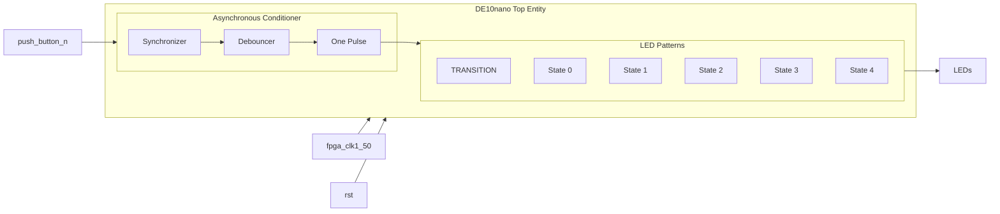

# Lab 4: LED Patterns

## Project Overview

> ## Functional Requirements

> ### Fixed Point
>
> A base rate is a reference rate (initial value). In this case, the base rate is 1 second because it is the base value for different LED tranistion rates.
>
> The base rate is a fixed point data type with a width (W = 8) and fixed point (F = 4). 
>
> ```vhdl
> base_rate : in std_ulogic_vector(7 downto 0); -- The value will be 00010000
> ```
>
> The base rate turns into 16 decimal with the additional zeros after the fixed point.
>
> There are 50,000,000 million clock cycles or periods per second because the system clock is 50 MHz.
>
> (base rate) x (clock cycles per second)
>

> ### LED Patterns
>
> |Specs|Transition|State 0|State 1|State 2|State 3|State 4|
> |-------|------------|------------|------------|------------|------------|------------|
> |Rate|1 second|1/2 second|1/4 second|2 seconds|1/8 second|1/16 second|
> |Pattern|Switch Value|Circular Right Shift|Circular Left Shift|Up Counter Wrap|Down Counter Wrap|The Wave|
> |Lit LEDS|N/A|1|2|N/A|N/A|N/A|
>


> ## System Architecture



> ## Implementation Details

> ### User LED Pattern
> 
> The LED pattern in State 4 (users choice) has a rate of 1/16 the base rate and a wave of lit LEDs roatating in a wave pattern.
>

> ### Summary
>
> The lab was difficult because it took five minutes to compile. I apporoached the lab with a brute force solution and then tried to cut out extra lines of code. 
> The LED patterns had to be modified to work with the testbench on modelsim. But I kept my original code because I thought it was cleaner. That is why there is 2 led pattern files.
>
> The idea of the lab was simple but the debugging was very challenging.
>
> I added a transition state because I was unable to get a working solution without it.
> 