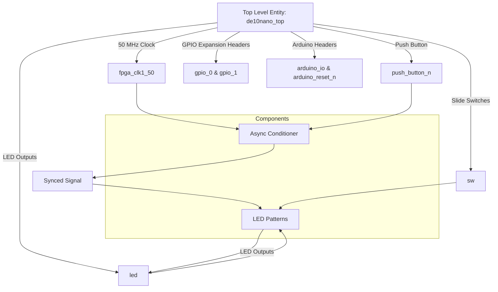

# Lab 2: Hardware Hello World

## Project Overview

> ## Functional Requirements

> ### Fixed Point
>
> A base rate is a reference rate (initial value). In this case, the base rate is 1 second because it is the base value for different LED tranistion rates.
>
> The base rate is a fixed point data type with a width (W = 8) and fixed point (F = 4). 
>
> ```vhdl
> base_rate : in std_ulogic_vector(7 downto 0); -- The value will be 00010000
> ```
>
> The base rate turns into 16 decimal with the additional zeros after the fixed point.
>
> There are 50,000,000 million clock cycles or periods per second because the system clock is 50 MHz.
>
> (base rate) x (clock cycles per second)
>

> ## System Architecture



```mermaid
graph TD;
    
    %% DE10-Nano top entity as the main square
    subgraph DE10_Nano_Top [de10nano_top]
        direction TB;

        %% Inputs into DE10-Nano Top
        clk1_50[50 MHz Clock Input] -->|clk1_50| DE10_Nano_Top;
        push_button[Push Button Input] -->|push_button_n| DE10_Nano_Top;
        sw[Slide Switches] -->|sw| DE10_Nano_Top;

        %% Async Conditioner block
        subgraph Async_Conditioner [Async Conditioner]
            direction TB;
            Debouncer --> OnePulse;
            OnePulse --> Synchronizer;
        end

        %% Connections for the async conditioner
        DE10_Nano_Top -->|Push Button Input| Async_Conditioner;
        Async_Conditioner -->|Synced Signal| SyncedSignal[Synced Signal];

        %% LED Patterns block
        subgraph LED_Patterns [LED Patterns]
            SyncedSignal --> LED_Patterns;
            sw -->|Switches| LED_Patterns;
        end

        %% LED output from LED Patterns through DE10-Nano top
        LED_Patterns -->|LED Output| led_out[External LED];
        led_out --> DE10_Nano_Top;

    end

    %% Final external LED connection
    DE10_Nano_Top -->|LED| led[LED];

    end
```
>
> ## Implementation Details

> ### User LED Pattern
> 
> The LED pattern in State 4 (users choice) has a rate of 1/16 the base rate and 1 light LED in a circular left shift pattern.
>
> 
## Deliverables

N/A

### Questions 

N/A